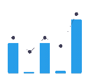

<h1 align="center">
    
</h1>

 

##  About me

   
<h4>
	
🎓 I’m currently studying Computer Science and Engineering at [ADUST](https://www.adust.edu.bd/#/)

🌐 Passionate about technology, programming, and virtual exploration

🚀 I excel in **Software Development**

💻 Currently exploring **Machine Learning**

</h4>

 

 
   

##  My Skills

	
### Languages

| Python | C++ | C | JavaScript | TypeScript | Java | C# | MATLAB | SQL | HTML | CSS | LaTeX |
|--------|-----|---|------------|------------|------|----|--------|-----|------|-----|-------|
|  |  |  |  |  |  |  |  |  |  |  |  |

### Frontend Library & Frameworks

| Bootstrap | Tailwind CSS | Chakra UI | React | Next.js | Nuxt.js |
|-----------|--------------|------------|-------|---------|---------|
|  |  |  |  |  |  |

### Backend Frameworks

| Django | Node.js | Express.js | NestJS |
|--------|---------|-------------|--------|
|  |  |  |  |

### Mobile Development

| React Native |
|--------------|
|  |

### AI, ML & DS

| NumPy | Pandas | Matplotlib | Seaborn | Plotly | Scikit-learn | PyTorch |
|-------|--------|------------|---------|--------|---------------|---------|
|  |  |  |  |  |  |  |

### Databases

| MySQL | SQLite | PostgreSQL | MongoDB | Firebase | Supabase |
|-------|--------|-------------|---------|----------|----------|
|  |  |  |  |  |  |

### AI Automation

| n8n |
|-----|
|  |

### Tools

| Git | VS Code | Sublime | Figma | IntelliJ | Postman | GitHub | Colab | Anaconda |
|-----|--------|---------|-------|----------|---------|--------|-------|----------|
|  |  |  |  |  |  |  |  |  |

### Operating Systems

| Windows | Arch Linux | Ubuntu | Kali Linux | Android |
|---------|------------|--------|-------------|---------|
|  |  |  |  |  |

##  Github Stats

<!--  -->
<!--  -->

##  My Contribution Graph

 <h2> Python Eating My Contributions</h2>
  

##  My Competitive Programming Profiles

    	
  &emsp;
    
  &emsp;
    
  &emsp;
    

##  Connect with me

	
    &emsp;
	
	&emsp;
	
	&emsp;
	
    &emsp;
	
    &emsp;
	

