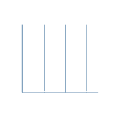

<h1 align="center">
    
</h1>

 

##  About me

   
<h4>
	
🎓 I’m currently studying Computer Science and Engineering at [ADUST](https://www.adust.edu.bd/#/)

🌐 Passionate about technology, programming, and virtual exploration

🚀 I excel in **Full Stack Development**, **OOP**, **DSA**, **DBMS**

💻 Currently learning **MERN Stack**

</h4>

 

 
   

##  My Skills

    
 
    
###  Languages:

| Python | C++ | C | JavaScript | TypeScript | Java | MATLAB | SQL | HTML | CSS | LaTeX |
|--------|-----|---|------------|------------|------|--------|-----|------|-----|-------|
|  |  |  |  |  |  |  |  |  |  |  |

 

###  Frameworks:

| Django | Bootstrap | Tailwind CSS | React.js | Node.js | Express.js | Next.js |
|--------|-----------|--------------|-----------|---------|------------|---------|
|  |  |  |  |  |  |  |

 

###  Databases:

| MySQL | SQLite | PostgreSQL | MongoDB |
|-------|--------|-------------|---------|
| |  |  |  |

 

###  Environment and Tools:

| Git | VS Code | Sublime   Text | Figma | IntelliJ   IDEA | Postman | GitHub |
|-----|---------|--------------------|-------|---------------|---------|--------|
|  |  |  |   |  |  |  |

 

###  Operating Systems:

| Windows | Linux | Ubuntu | Kali Linux | Android |
|---------|-------|--------|------------|---------|
|  |  |  |  |  |

 

##  Github Stats

 

 

##  My Contribution Graph

 

 <h2> Python Eating My Contributions</h2>

   
  
  
   

##  My Competitive Programming Profiles

  &emsp;
    	
  &emsp;
    
  &emsp;
    
  &emsp;
    

##  Connect with me

	
    &emsp;
	
    &emsp;
	
    &emsp;
	
    &emsp;
	

